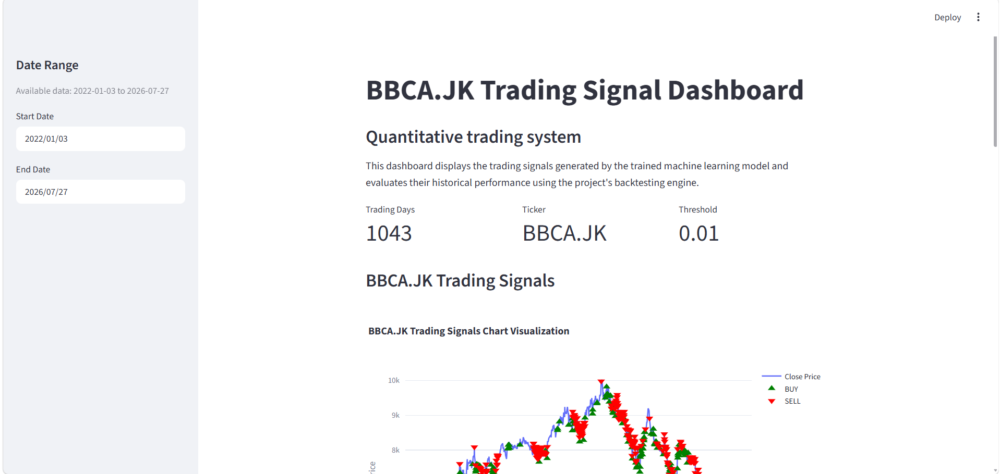
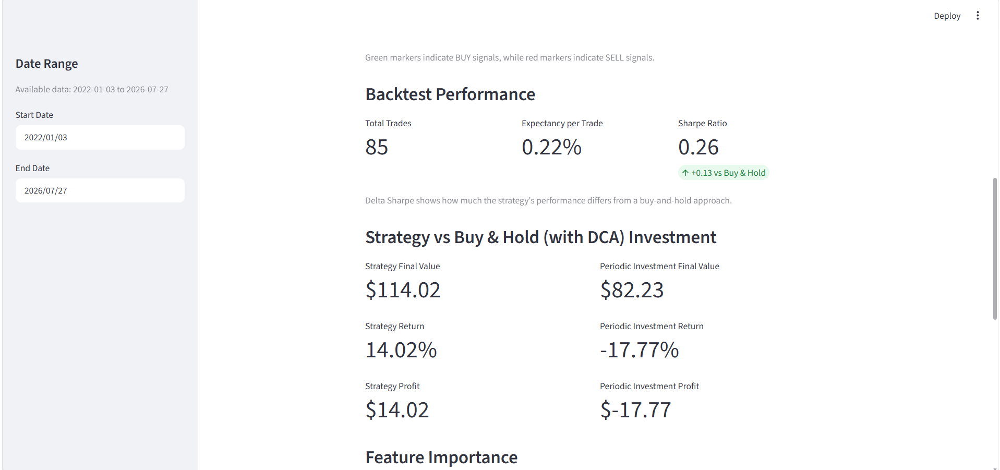
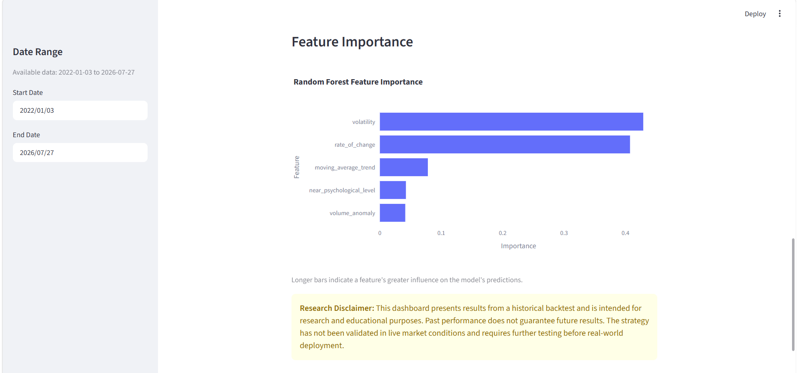

# BBCA.JK Machine-Learning-Based Quantitative Trading System

## Overview

An end-to-end quantitative trading system that generates BUY/SELL signals for BBCA.JK (Bank Central Asia) using a machine learning model. The strategy is evaluated through backtesting with transaction costs and time-series-aware validation. The project covers the full pipeline: data validation, feature engineering, model training with walk-forward validation, signal generation, backtesting, and an interactive Streamlit dashboard comparing the strategy with a periodic DCA investment benchmark.

This project was built as a portfolio project to practice the complete ML workflow, with a focus on data quality, leakage-safe validation, and evaluating whether model predictions translate into useful trading performance under realistic backtesting conditions.

## Dashboard



The project includes an interactive Streamlit dashboard for exploring model-generated trading signals, backtest performance, and the strategy's performance against periodic DCA.

### Trading Signals


The dashboard visualizes the BBCA.JK closing price together with BUY and SELL signals generated by the model. A date range selector is available in the sidebar to make the chart easier to inspect.

### Backtest Performance & Strategy vs. DCA



The backtest section reports key metrics including total trades, expectancy per trade, and Sharpe ratio. The strategy's Sharpe ratio is compared with a buy-and-hold benchmark to provide context on its risk-adjusted performance.

The dashboard also compares the strategy's final value, return, and profit with a periodic DCA investment using the same initial capital. This provides a simple comparison between actively trading based on model signals and continuing to invest periodically through the same market conditions.

### Feature Importance



The feature importance chart shows the relative importance of each technical feature used by the Random Forest model.

## Business Problem

In recent years, BBCA has experienced periods of significant price weakness, particularly during 2025–2026. This creates a practical question for market participants: when a traditionally strong stock enters a prolonged downtrend or bear market, is there a systematic way to reduce exposure during unfavorable market conditions while still potentially capturing a profitable moves?

A simple buy-and-hold approach requires investors to remain fully exposed throughout the decline and rely on the stock eventually recovering from the drawdown. An alternative is Dollar-Cost Averaging (DCA), where the initial capital is divided into smaller amounts and invested periodically rather than all at once. While DCA reduces the risk of entering entirely at an unfavorable price, it still maintains exposure as the stock continues to decline.     

One potential approach is to use market signals to identify periods of upward and downward price movement, allowing a strategy to reduce exposure or change positions as market conditions deteriorate.

This project explores that idea by building a machine-learning-based prediction and trading signal system for BBCA.JK. The goal is not to assume that the model can consistently outperform the market, but to see whether those predictions actually produce better trading results when tested through realistic backtesting.

Most beginner ML trading projects stop at classification accuracy. This project treats accuracy as only the first checkpoint: a model that predicts price direction well does not necessarily produce a profitable trading strategy. Model performance and trading performance are therefore evaluated separately, with the strategy also compared against a simple periodic DCA benchmark to assess whether the signals provide value beyond a passive investment approach.

## Architecture

The pipeline is organized into five decoupled modules:

- **`src/data/`**: fetches OHLCV data using `yfinance`, checks for missing values, duplicate dates, trading-calendar gaps, and suspended-trading days, then returns a validated dataset.

- **`src/features/`**: calculates the technical features used by the model, including rolling volatility, rate of change, moving-average trend, volume anomaly, and proximity to psychological price levels. All features use only past data to avoid lookahead bias.

- **`src/models/`**: handles label creation using a threshold-based T+1 forward return, Random Forest training with `TimeSeriesSplit` and `GridSearchCV`, and model persistence with `joblib`.

- **`src/signals/`**: combines model predictions with a rule-based moving-average trend veto. This module is built and tested but is not used in the default baseline (see Limitations).

- **`src/backtest/`**: contains the backtest engine, performance metrics, and strategy-vs-DCA comparison. The engine uses T+1 execution, transaction costs, and mark-to-market closing.

A key design decision: the backtest engine was built independently and has no knowledge of how a signal was generated. It was built and unit-tested first, using dummy signals, before being connected to the ML model. This made it easier to identify whether unexpected results came from the model, the data, or the backtesting logic itself.

All configurable parameters (ticker, date range, label threshold, model hyperparameters, transaction costs, initial capital) are stored in `config/config.yaml`, with `main.py` serving as a single orchestrator.

Full development notes, including bugs found and design decisions made along the way, are in [`NOTES.md`](./NOTES.md).

## Results

*(Run `python main.py` or launch the dashboard to reproduce the results. The results vary somewhat between runs due to `GridSearchCV`'s parallel execution. The ranges below reflect multiple actual runs during development.)*

| Metric                           |         Observed Range |
| -------------------------------- | ---------------------: |
| Total trades                     | ~85–96 over ~4.5 years |
| Expectancy per trade             |       +0.14% to +0.36% |
| Annualized Sharpe (strategy)     |              0.17–0.41 |
| Annualized Sharpe (buy-and-hold) |                  ~0.13 |

**Strategy vs. periodic DCA investment**

$100 total initial capital, divided equally across three investment dates per year from 2022–2026. 2026 includes only two investment dates because the third scheduled date falls outside the available dataset (which ends in July 2026) . 

|                         | Final Value |  Return |
| ----------------------- | ----------: | ------: |
| ML Trading Strategy     |     $137.54 | +37.54% |
| Periodic DCA Investment |      $82.23 | -17.77% |


BBCA.JK reached an all-time high of Rp 10,950 on September 24, 2024, and has been in a clear downtrend since then. Then the price fell roughly 31% to Rp 7,500 by October 2025 ([source](https://keuangan.kontan.co.id/news/saham-bbca-turun-ke-rp-7500-jadi-harga-penutupan-terendah-sepanjang-tahun-2025), [source](https://id.tradingview.com/symbols/IDX-BBCA/)). A naive DCA schedule that kept buying through this period took a real hit; The ML strategy generated SELL signals during parts of this decline, resulting in a higher final backtest value than the periodic DCA benchmark in the representative run.

## Limitations

This project prioritizes methodological honesty over impressive-looking numbers:

- **Non-determinism**: trade count and performance metrics vary noticeably between runs (see Results above), likely due to `GridSearchCV`'s parallel execution (`n_jobs=-1`), despite a fixed `random_state`. Not yet root-caused or fixed.
- **Small sample size**: even at the high end, ~90 trades over 4.5 years is not enough to make a statistically strong claim about profitability.
- **Feature strength**: the 5 technical features used may be insufficient to predict >1% daily moves in a highly liquid, closely-watched stock like BBCA.JK. This is consistent with efficient market behavior, not a flaw in the validation methodology.
- **Psychological price levels**: the feature currently uses a fixed Rp500 interval to define psychological price levels. This was chosen based on BBCA.JK's current price range, but it may need to be adjusted if the stock price moves significantly higher or lower in the future.
- **Rule-based veto not validated**: a moving-average-trend veto was built and tested but not adopted as the default, since its 10-trade sample was too small to draw any reliable conclusion either way.
- **No position sizing or stop-loss**: the backtest assumes a single position at a time with no risk management beyond entry/exit signals.
- **Not validated in live conditions**: all results are from historical backtesting only. See the disclaimer in the dashboard itself.

## Getting Started

```bash
# 1. Clone the repository
git clone https://github.com/marckurniawan/quant-project.git
cd quant-project

# 2. Create and activate a virtual environment
python -m venv .venv
.venv\Scripts\activate       # Windows
# source .venv/bin/activate  # macOS/Linux

# 3. Install dependencies
pip install -r requirements.txt

# 4. Run the full pipeline 
python main.py

# 5. Launch the dashboard
streamlit run app/dashboard.py
```

Configuration (ticker, date range, model hyperparameters, transaction costs, initial capital) can be adjusted in `config/config.yaml` without touching any code.

## Development Process

This project was built iteratively across 8 milestones, with a strong emphasis on verifying assumptions before trusting them. Along the way, I found several issues that changed how the project was implemented: a silent yfinance date-exclusivity issue, missing Indonesian cuti bersama holidays in the trading calendar, the need for a custom F1 scorer to prevent the model from relying on the majority HOLD class, and the need to verify BBCA.JK's actual price trend before drawing conclusions from the DCA comparison.

The full log of bugs found, design decisions made, and their reasoning behind them is documented milestone-by-milestone in [`NOTES.md`](./NOTES.md).

## Next Steps

- Investigate and fix the `GridSearchCV` non-determinism (likely `n_jobs=-1` related)
- Validate the moving-average-trend veto with a longer data history
- Explore additional/interaction features to improve signal strength
- Extend to LQ45/multi-ticker screening (see Architecture config-driven ticker was designed with this in mind)